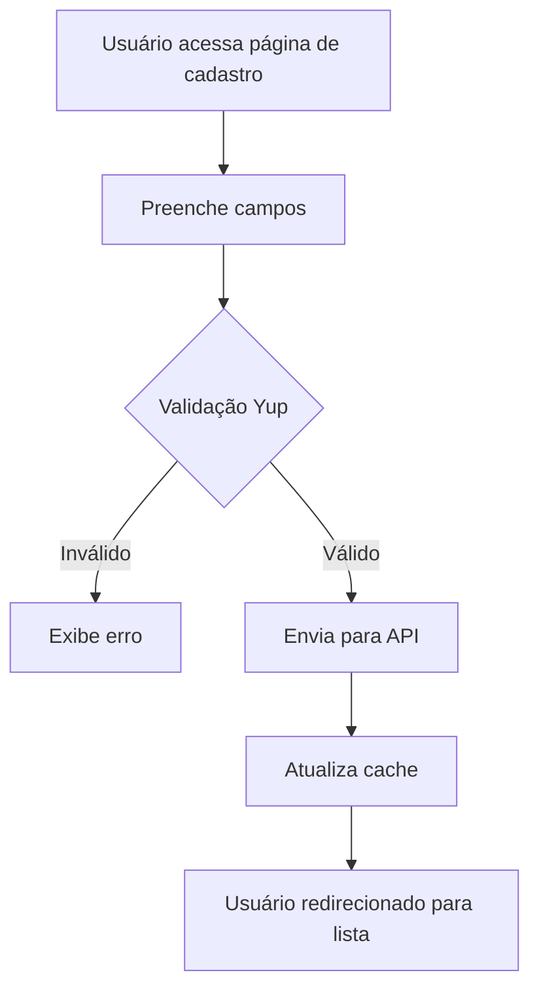

# Checklist do Desafio Técnico

| Requisito                                                                 | Atendido |
|--------------------------------------------------------------------------|:--------:|
| Tela de listagem de usuários (API REST)                                  |    ✅    |
| Tela de cadastro/edição (nome, e-mail, telefone, cidade, estado)         |    ✅    |
| Validação de formulário                                                  |    ✅    |
| Requisições via Axios com tratamento de erros                            |    ✅    |
| Componentes reutilizáveis                                                |    ✅    |
| Navegação entre páginas (React Router)                                   |    ✅    |
| Estilização livre, responsividade, usabilidade e estética visual         |    ✅    |
| Organização em pastas e Clean Architecture                               |    ✅    |
| Pronto para Context API (expansível)                                     |    ✅    |
| Testes unitários (Vitest + Testing Library)                              |    ✅    |

---


# User Management SaaS Dashboard

Sistema de gerenciamento de usuários (CRUD) moderno, simples de entender e fácil de adaptar. Desenvolvido em **React + TypeScript** seguindo **Clean Architecture** e boas práticas de frontend.

---


## Sumário
- [Visão Geral](#visão-geral)
- [Tecnologias Utilizadas](#tecnologias-utilizadas)
- [Arquitetura e Pastas](#arquitetura-e-pastas)
- [Funcionalidades](#funcionalidades)
- [Como Executar](#como-executar)
- [Testes](#testes)
- [Variáveis de Ambiente](#variáveis-de-ambiente)
- [Detalhes de Implementação](#detalhes-de-implementação)

---


## Visão Geral
Este projeto é um painel para cadastro, edição, listagem e remoção de usuários, com busca em tempo real, validação de dados e interface responsiva/dark mode. O código é organizado, comentado e pronto para ser expandido.

## Tecnologias Utilizadas
- **React** + **TypeScript**
- **Vite** (build e HMR)
- **React Router DOM** (rotas SPA)
- **Axios** (requisições HTTP)
- **React Hook Form** + **Yup** (formulários e validação)
- **TailwindCSS** (estilização e dark mode)
- **Vitest** + **Testing Library** (testes unitários)
- **ESLint** (padronização de código)


## Arquitetura e Pastas
O projeto segue Clean Architecture, separando responsabilidades:

```
src/
  domain/           # Entidades de domínio (ex: User)
  application/      # Casos de uso e cache (ex: userService, userCache)
  infrastructure/   # Comunicação com API (ex: userApi)
  presentation/     # Componentes, páginas, hooks, UI
    components/     # Componentes reutilizáveis (Button, Input, Layout, etc)
    pages/          # Páginas principais (UserListPage, UserFormPage)
    hooks/          # Hooks customizados (useUsers, useTheme, useToast)
  routes/           # Rotas da aplicação
```


## Funcionalidades
- Listagem, cadastro, edição e remoção de usuários
- Busca em tempo real (nome, email, cidade, estado)
- Validação de formulário (nome, email, telefone, cidade, estado)
- Máscara automática para telefone
- Componentes reutilizáveis: Button, Input, Layout, Modal, SearchBar, Toast
- Feedback visual: loading, erro, toasts, modal de confirmação
- Responsivo e dark mode (preferência salva no localStorage)
- Hooks customizados para usuários, tema e toasts
- Testes unitários com Vitest e Testing Library


## Como Executar
1. Instale as dependências:
  ```sh
  npm install
  ```
2. Configure as variáveis de ambiente:
  - Copie `.env.example` para `.env` e ajuste a URL da API se necessário.
  ```env
  VITE_API_URL=http://localhost:3001/api
  ```
3. Rode o projeto em modo desenvolvimento:
  ```sh
  npm run dev
  ```
4. Acesse [http://localhost:5173](http://localhost:5173) no navegador.


## Testes
Execute os testes unitários:
```sh
npm run test
```


## Variáveis de Ambiente
O sistema utiliza uma variável para a URL da API:
```env
VITE_API_URL=http://localhost:3001/api
```


## Responsividade e Experiência Mobile

O sistema foi projetado para funcionar perfeitamente em dispositivos móveis e desktops, garantindo boa usabilidade em qualquer tamanho de tela.

**Como a responsividade foi implementada:**
- Utilização do TailwindCSS, que oferece utilitários para breakpoints (`sm`, `md`, `lg`, `xl`), espaçamentos e layouts flexíveis.
- Componentes e formulários usam classes responsivas para ajustar tamanhos, margens e fontes conforme a tela.
- Layout principal centralizado, com largura máxima e padding adaptativos.
- Botões, inputs e listas são facilmente clicáveis/tocáveis em telas pequenas.
- Modal, toasts e feedbacks visuais são exibidos de forma clara tanto no mobile quanto no desktop.

**Exemplo de classe responsiva:**
```html
<div className="max-w-lg w-full mx-auto p-4 sm:p-6 md:p-8">
  ...
</div>
```

**Testes de responsividade:**
- O sistema foi testado em navegadores mobile (Chrome DevTools, Firefox, Safari) e dispositivos reais.
- Todos os fluxos (cadastro, edição, busca, exclusão) funcionam normalmente em telas pequenas.

**Dicas para expandir:**
- Para customizar ainda mais, basta alterar as classes Tailwind nos componentes.
- Pode-se adicionar media queries customizadas ou componentes específicos para mobile se desejar.

---

## Detalhes de Implementação


### Clean Architecture
- **domain/**: Define a entidade `User`.
- **application/**: Define a interface `UserService` e o cache de usuários.
- **infrastructure/**: Implementa a comunicação com a API usando Axios.
- **presentation/**: UI, hooks e lógica de interação.


## Detalhes de Implementação

### Clean Architecture (Resumo)
- **domain/**: Entidade `User` (estrutura dos dados)
- **application/**: Interface `UserService` e cache de usuários
- **infrastructure/**: Comunicação com a API (Axios)
- **presentation/**: Componentes, páginas, hooks e lógica de UI

---

### 🗂️ Cache de Usuários (Performance e Experiência)
O cache armazena os usuários em memória para evitar requisições desnecessárias e deixar a navegação instantânea.

**Como funciona:**
1. Ao abrir a lista, busca do cache (`userCache.getUsers()`).
2. Se vazio, busca da API e popula o cache.
3. Ao criar/editar/remover, atualiza o cache e o estado local.

**Exemplo de uso:**
```ts
// Buscar usuários
const users = userCache.getUsers();
// Adicionar novo usuário
userCache.addUser(novoUsuario);
// Atualizar usuário
userCache.updateUser(id, { name: 'Novo Nome' });
// Remover usuário
userCache.deleteUser(id);
```

**Vantagens:**
- Navegação rápida
- Menos requisições
- Experiência fluida

---

### ✅ Validações de Formulário (Segurança e Usabilidade)
As validações são feitas com **Yup** e **React Hook Form** para garantir dados corretos e feedback imediato ao usuário.

**Regras:**
- Nome: obrigatório
- Email: obrigatório e formato válido
- Telefone: obrigatório, máscara automática (formato brasileiro)
- Estado: obrigatório
- Cidade: obrigatório

**Exemplo de schema:**
```ts
const schema = yup.object({
  name: yup.string().required('Nome obrigatório'),
  email: yup.string().email('Email inválido').required('Email obrigatório'),
  phone: yup.string().required('Telefone obrigatório'),
  state: yup.string().required('Estado obrigatório'),
  city: yup.string().required('Cidade obrigatória'),
}).required();
```

**Exemplo de campo com máscara e erro:**
```tsx
<Input label="Telefone" placeholder="Ex: 11999999999" {...register('phone')} error={errors.phone?.message} />
```

**Diferenciais:**
- Máscara automática para telefone
- Mensagens de erro claras abaixo de cada campo
- Cidades carregadas dinamicamente ao escolher o estado
- Formulário só é enviado se todos os campos estiverem válidos

---

## Fluxo Visual do Cadastro



---

## Dúvidas?
Abra uma issue ou entre em contato!
- **useTheme**: Alterna entre dark/light mode e salva preferência no localStorage.
- **useToast**: Exibe mensagens de feedback (sucesso, erro, info).

### Testes
- Testes unitários para componentes principais usando Vitest e Testing Library.

### Estilo e Responsividade
- Estilização com TailwindCSS, responsivo e com suporte a dark mode.

---

## Dúvidas?
Abra uma issue ou entre em contato!

## Tecnologias
- React + TypeScript
- Vite
- React Router DOM
- Axios
- React Hook Form + Yup
- TailwindCSS
- Vitest + Testing Library

## Estrutura de Pastas
```
src/
  domain/           # Entidades de domínio
  application/      # Casos de uso (serviços)
  infrastructure/   # Implementação de APIs
  presentation/     # Componentes, páginas, hooks
    components/
    pages/
    hooks/
  routes/           # Rotas da aplicação
```

## Funcionalidades
- Listagem, cadastro e edição de usuários 
- Busca em tempo real
- Validação de formulário (nome, email, telefone, cidade)
- Componentes reutilizáveis (Button, Input, Layout, SearchBar)
- Loading, erro, responsivo, dark mode (localStorage)
- Hooks customizados (useUsers, useTheme)
- Testes unitários (Vitest)

## Instalação
```sh
npm install
```

## Execução
```sh
npm run dev
```

## Testes
```sh
npm run test
```

## Variáveis de ambiente
Copie `.env.example` para `.env` e ajuste se necessário.

